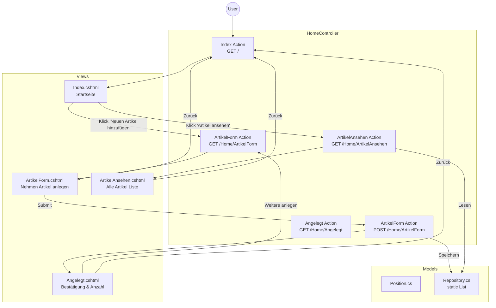

# 🚀 04_ShoppingList: ASP.NET Erste eigene App - Einkaufsliste

Welcome to 04_ShoppingList. This unit is part of the C# ASP.NET Core 10 fundamentals series.

## 🎯 Learning Objectives
- [ ] Implement core concepts for this unit (MVC, Model Binding, Routing).
- [ ] Master the architectural patterns demonstrated (Layering, View-Controller decoupling).
- [ ] Maintain 100% test coverage for new logic (TDD with xUnit).
- [ ] Follow SOLID, Clean Architecture, and DRY/KISS guidelines.

## 📈 Projektauftrag (IHK Prüfungsrelevant)
Erstellung einer ASP.NET Core-Anwendung zur Verwaltung einer Einkaufsliste. Die Anwendung speichert zu besorgende Artikel aus verschiedenen Geschäften.

### Kernanforderungen (Features)
- **Model**: Eine Klasse `Position` zur Speicherung von Artikelname, Anzahl und Geschäft.
- **Repository**: Eine statische Klasse `Repository` (In-Memory Datenspeicher) mit einer `List<Position>`.
- **Views**: `Index.cshtml`, `ArtikelForm.cshtml`, `Angelegt.cshtml`, `ArtikelAnsehen.cshtml`.
- **Controller**: Ein `HomeController`, der den Ablauf steuert.
- **Frontend-Architektur**: Utility-First Ansätze mit Tailwind CSS 4.2. Strikte Separation of Concerns durch modularisierte CSS-Dateien (`theme.css`, `layout.css`, `buttons.css`) basierend auf OOCSS/Atomic-Design Vorgaben inkl. FontAwesome 7.2.

### Architekturübersicht

## 📂 Folder Structure
- [**/src**](./src/README.md): Application source code and implementation details.
- [**/tests**](./tests/README.md): Automated testing suite and validation logic.

---
> [!IMPORTANT]
> Every unit in this repository is designed to be a standalone, fully testable component. Ensure you check both the source and the tests to understand the full context.

