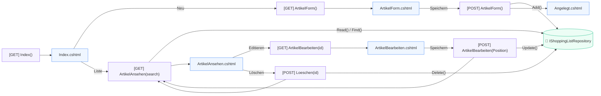
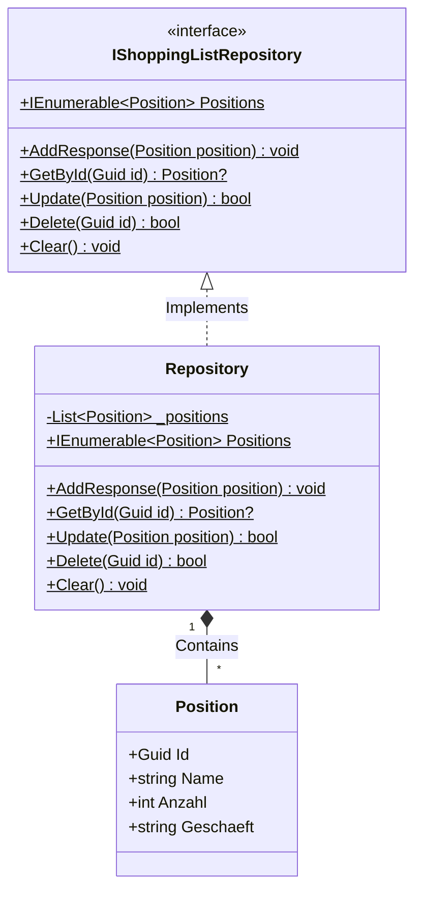
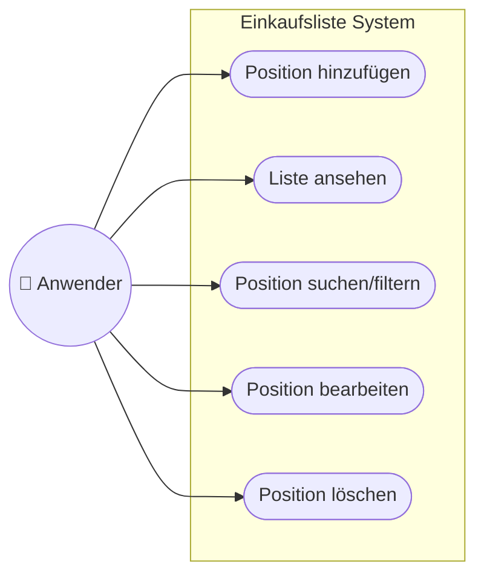

# Architektur Einkaufsliste

Hier ist die detaillierte architektonische Dokumentation der MVC-Implementierung für die Einkaufsliste (ASP.NET Core). Um maximale Übersichtlichkeit und Vollständigkeit nach IHK-Standards zu gewährleisten, ist die Dokumentation in vier spezifische UML-Diagramme unterteilt:

- **Blockdiagramm** (Architektur-Schichten vs. Separation of Concerns)
- **Ablauf- und Architekturdiagramm** (Data Flow / Navigation)
- **Klassendiagramm** (Domain Model)
- **Use-Case-Diagramm** (Anwendungsfälle)

## 1. Blockdiagramm (Schichten-Architektur)

Dieses Diagramm zeigt die strikte Trennung (Separation of Concerns) zwischen UI, Steuerung und Datenhaltung.

```mermaid
flowchart TD
    %% Styling
    classDef ui fill:#3b82f6,stroke:#1d4ed8,stroke-width:2px,color:#fff
    classDef controller fill:#8b5cf6,stroke:#6d28d9,stroke-width:2px,color:#fff
    classDef data fill:#10b981,stroke:#047857,stroke-width:2px,color:#fff

    User((👤 Client / Browser))

    subgraph Presentation ["Presentation Layer (Views)"]
        UI["CSS Module (Tailwind 4.2)<br>Razor Views (.cshtml)"]:::ui
    end

    subgraph Application ["Application Layer (Controller)"]
        HC["HomeController.cs<br>(Routing & Actions)"]:::controller
    end

    subgraph Domain ["Domain Layer (Models)"]
        PM["Position.cs<br>(Entity)"]:::data
        IRepo<<"IShoppingListRepository.cs<br>(Interface)">>:::data
        Repo[("Repository.cs<br>(In-Memory Store)")]:::data
    end

    User <--> Presentation
    Presentation <--> Application
    Application --> PM
    Application --> IRepo
    IRepo <.. Repo : Implements
```

## 2. Ablauf- und Architekturdiagramm (Data Flow)

Dieses Diagramm verdeutlicht den konkreten Datenfluss und die Navigation zwischen den Views und Controller-Actions.



## 3. Klassendiagramm (Domain Layer)

Veranschaulicht die zugrundeliegende Datenstruktur (`Position`) und den Singleton-In-Memory-Speicher (`Repository`).



## 4. Use-Case-Diagramm (Applikationsnutzer)

Definiert die grundlegenden Geschäftsprozesse, die der Nutzer ausführen darf (CRUD auf Item-Ebene).


