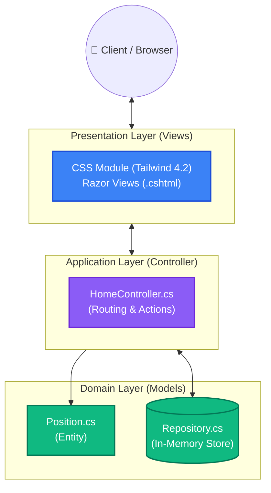
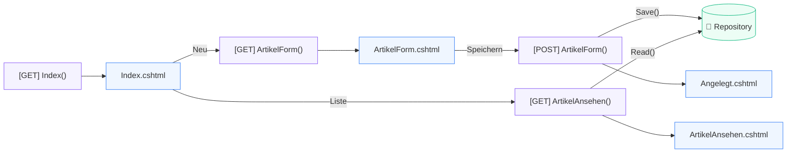

# Architektur Einkaufsliste

Hier ist die vereinfachte grafische Übersicht der MVC-Architektur für die Einkaufsliste (ASP.NET Core). Um maximale Übersichtlichkeit zu gewährleisten, ist die Darstellung in zwei Diagramme unterteilt: Ein grobes **Blockdiagramm** (Komponenten & Schichten) und ein präzises **Ablaufdiagramm** (Data Flow).

## 1. Blockdiagramm (Schichten-Architektur)

Dieses Diagramm zeigt die strikte Trennung (Separation of Concerns) zwischen UI, Steuerung und Datenhaltung.

## 2. Ablauf- und Architekturdiagramm (Data Flow)

Dieses Diagramm verdeutlicht den konkreten Datenfluss und die Navigation zwischen den Views und Controller-Actions.

