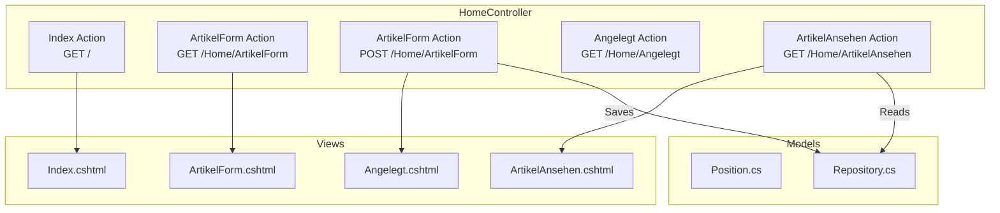

# 🛠️ 04_ShoppingList - Source Code (/src)

This directory contains the primary ASP.NET Core 10 MVC application "Einkaufsliste".

## 🏗️ Technical Overview
- **Framework**: .NET 10 MVC
- **Design System**: Tailwind CSS 4.2 (OOCSS, Utility-First) & FontAwesome 7.2
- **Namespace**: `_04_ShoppingList`
- **Frontend Architecture**: Ausgelagerte Tailwind-Styling-Module unter `/wwwroot/css/modules/` für sauberes Separation of Concerns.

## 📐 Architektur & Datenfluss


## 🚀 How to Run
From this directory:
```bash
dotnet run
```

