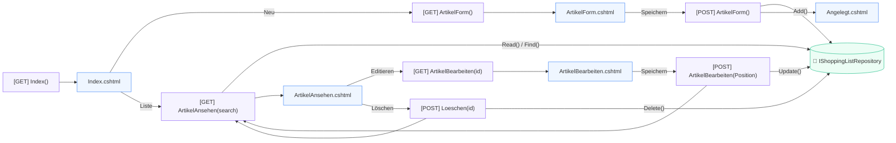

# 🛠️ 04_ShoppingList - Source Code (/src)

This directory contains the primary ASP.NET Core 10 MVC application "Einkaufsliste".

## 🏗️ Technical Overview
- **Framework**: .NET 10 MVC
- **Design System**: Tailwind CSS 4.2 (OOCSS, Utility-First) & FontAwesome 7.2
- **Namespace**: `_04_ShoppingList`
- **Frontend Architecture**: Lokales Hosting via LibMan (`wwwroot/lib/`) für volle Offline-Fähigkeit. Strikte "Single File Component" (SFC) Architektur durch Verwendung von ASP.NET Core CSS Isolation (`.cshtml.css`). Aufgeräumt durch globale Atomic-Komponenten (`btn.css` etc.) und eigene Tag Helper.

> [!TIP]
> **Tailwind v4 Local Architecture:** Da das `@tailwindcss/browser@4` Skript lokal eingebunden ist, werden die Seiten clientseitig blitzschnell gerendert. Komplexe Utility-Ketten wurden in `.cshtml.css`-Dateien (`@apply`) ausgelagert, um den HTML-Code (Separation of Concerns) extrem übersichtlich zu halten.

## 📐 Architektur & Datenfluss


> 💡 **Erweiterte Diagramme:** Das detaillierte Layer-Architektur-Zusammenspiel finden Sie in der [Architekturdokumentation](../docs/Architektur_Einkaufsliste.md).

## 🚀 How to Run
From this directory:
```bash
dotnet run
```

