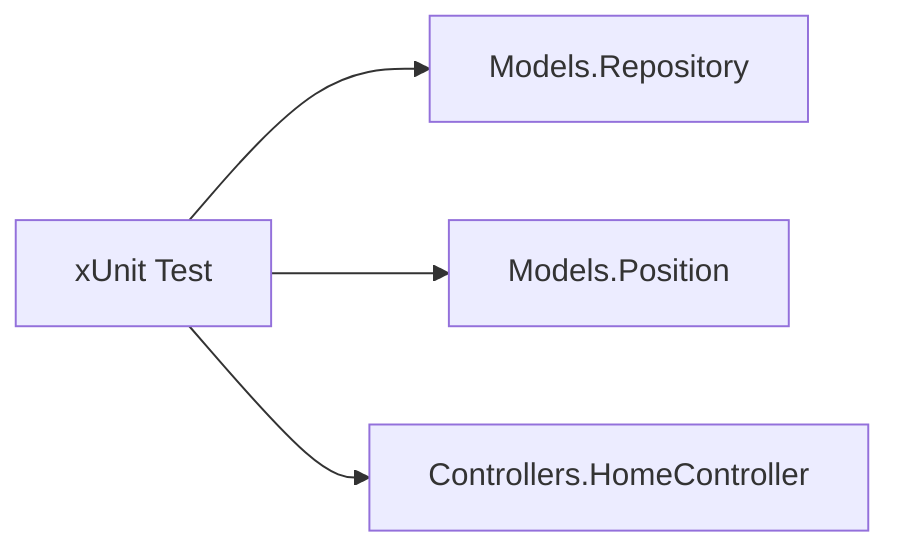

# 🛡️ 04_ShoppingList - Testing Infrastructure (/tests)

This directory contains the **xUnit** test project for the Einkaufsliste app.

## 🧪 Strategy
- **Framework**: xUnit
- **Coverage Goal**: 100% on Domain Models & Controller Logic
- **Patterns**: TDD (Red-Green-Refactor)

## 📐 Getesteter Flow
Die Tests verifizieren das Model, das Repository sowie die Steuerung durch den HomeController:


## 🏃 How to Run Tests
From this directory:
```bash
dotnet test
```

> [!TIP]
> Use these tests as a starting point for your own TDD practice.

