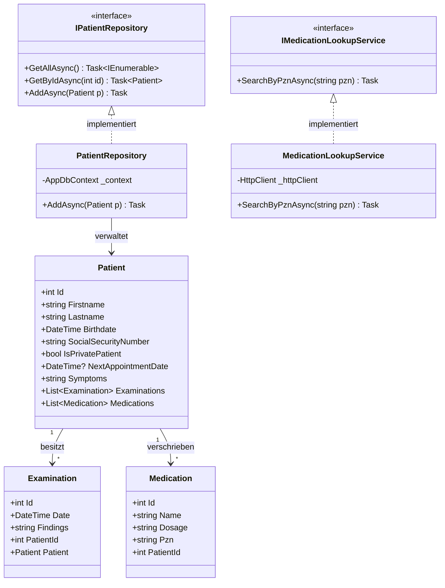
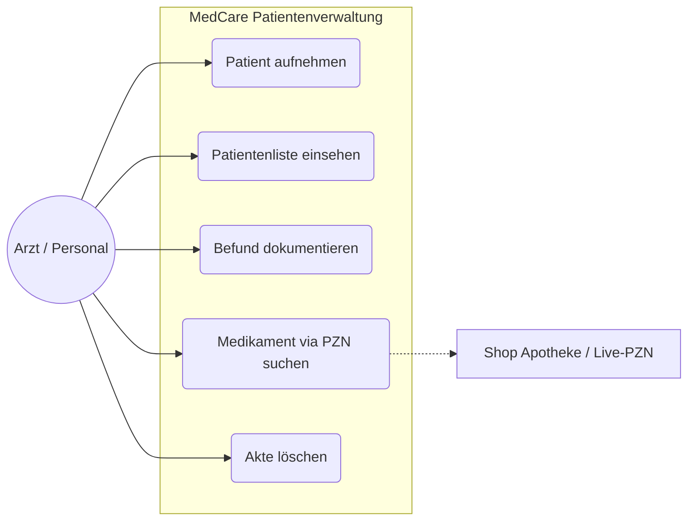
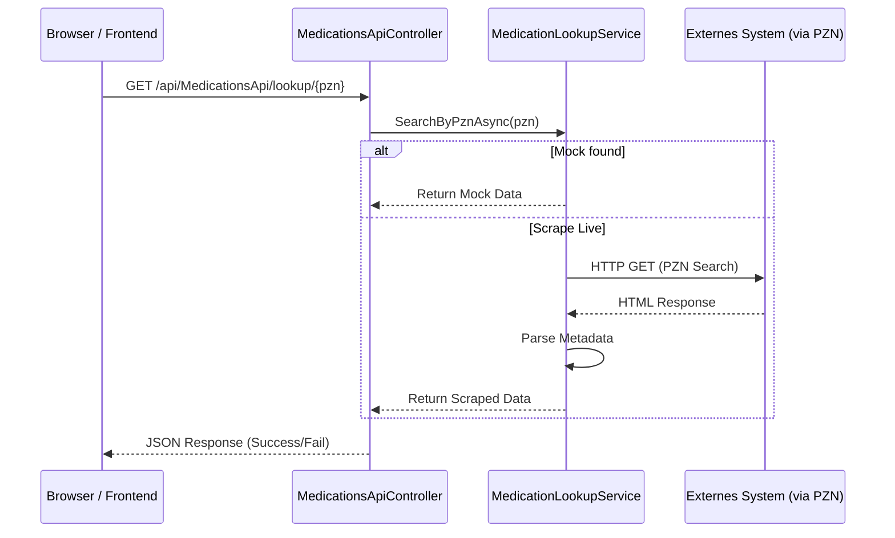
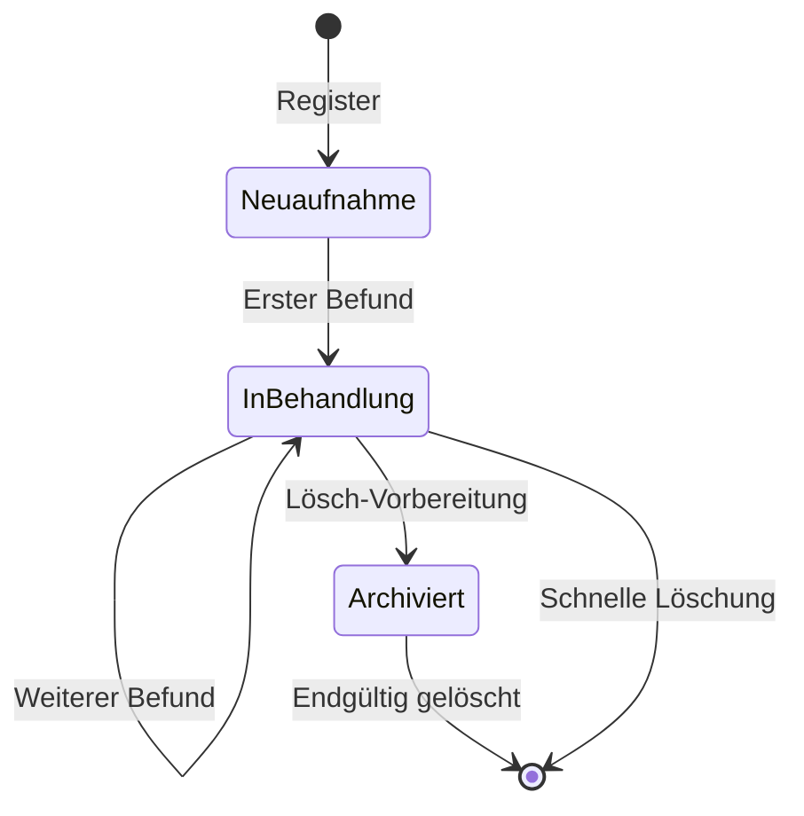
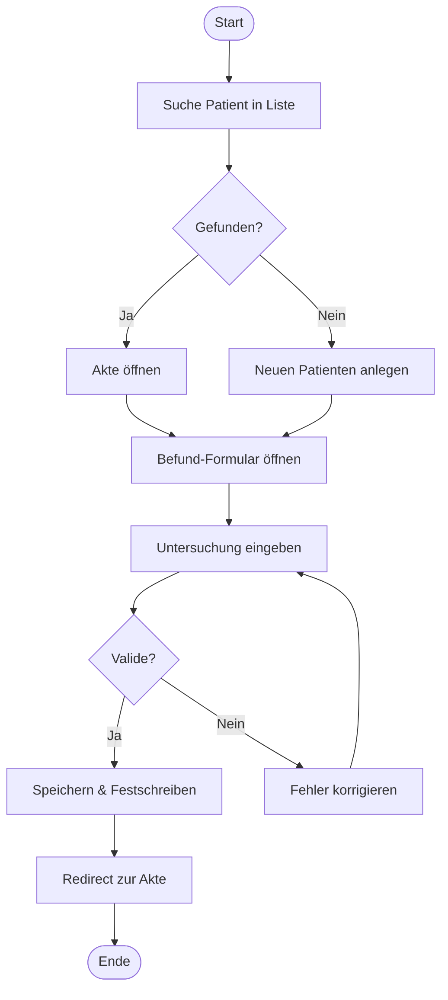
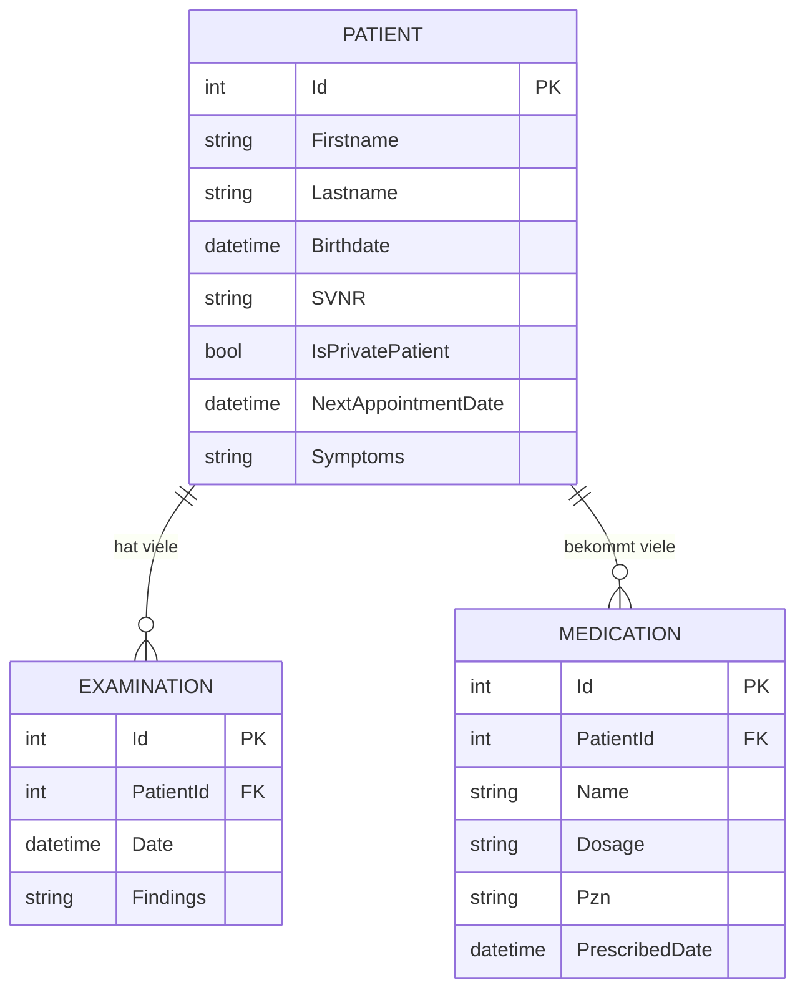

# 📊 Unit 07: UML & System-Architektur

Dieses Dokument visualisiert die Architektur und die Abläufe der **MedCare Patientenverwaltung** mittels Mermaid.js.

## 1. Klassendiagramm (Struktur)
Zeigt die Domänen-Entitäten, Repositories und deren Beziehungen.

## 2. Use Case Diagramm (Funktionalität)
Beschreibt die Interaktion der Praxis-Mitarbeiter mit dem System.

## 3. Sequenzdiagramm (Ablauf: PZN Live-Check)
Visualisiert den asynchronen Datenfluss bei der Medikamenten-Suche.

## 4. Zustandsdiagramm (Patienten-Status)
Zeigt den Lebenszyklus eines Patienten im System.

## 5. Aktivitätsdiagramm (Prozess: Untersuchung)
Detaillierter Prozess für das Personal während einer Untersuchung.

## 6. Entity Relationship Diagram (Datenbank)
Das physische Datenmodell (Code-First Schema).

