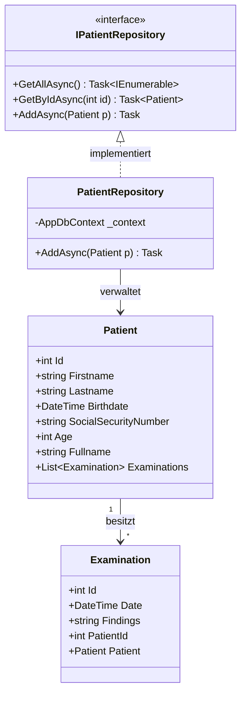
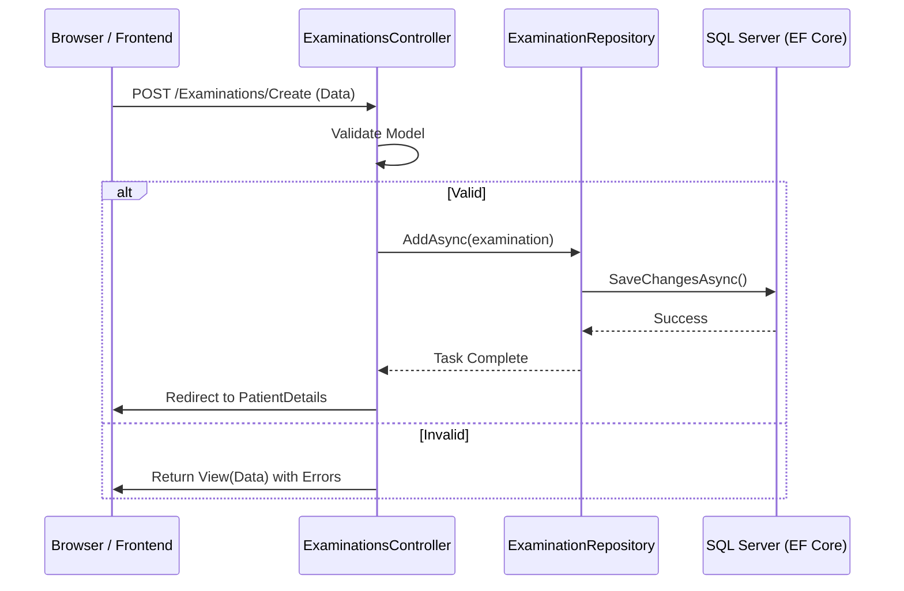
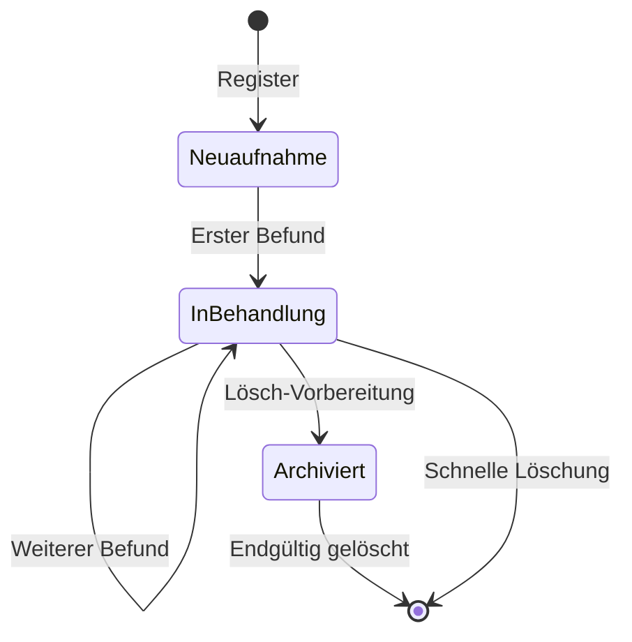
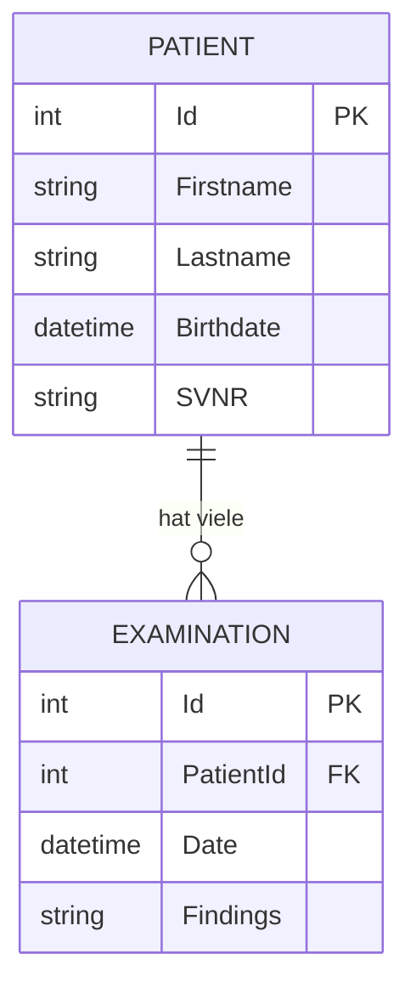

# 📊 Unit 07: UML & System-Architektur

Dieses Dokument visualisiert die Architektur und die Abläufe der **MedCare Patientenverwaltung** mittels Mermaid.js.

## 1. Klassendiagramm (Struktur)
Zeigt die Domänen-Entitäten, Repositories und deren Beziehungen.



## 2. Use Case Diagramm (Funktionalität)
Beschreibt die Interaktion der Praxis-Mitarbeiter mit dem System.

```mermaid
useCaseDiagram
    actor "Arzt / Personal" as Staff
    
    package MedCare {
        usecase "Patient aufnehmen" as UC1
        usecase "Patientenliste einsehen" as UC2
        usecase "Befund dokumentieren" as UC3
        usecase "Akte löschen" as UC4
    }
    
    Staff --> UC1
    Staff --> UC2
    Staff --> UC3
    Staff --> UC4
```

## 3. Sequenzdiagramm (Ablauf: Befund erfassen)
Visualisiert den asynchronen Datenfluss beim Speichern eines neuen Befunds.



## 4. Zustandsdiagramm (Patienten-Status)
Zeigt den Lebenszyklus eines Patienten im System.



## 5. Aktivitätsdiagramm (Prozess: Untersuchung)
Detaillierter Prozess für das Personal während einer Untersuchung.

```mermaid
activityDiagram
    start
    :Suche Patient in Liste;
    if (Patient gefunden?) then (Ja)
        :Akte öffnen;
    else (Nein)
        :Neuen Patienten anlegen;
    endif
    :Befund-Formular öffnen;
    :Ergebnisse der Untersuchung eintragen;
    if (Eingaben valide?) then (Ja)
        :Befund festschreiben (Speichern);
    else (Nein)
        :Fehler korrigieren;
        stop
    endif
    :Redirect zur Akte;
    stop
```

## 6. Entity Relationship Diagram (Datenbank)
Das physische Datenmodell (Code-First Schema).


