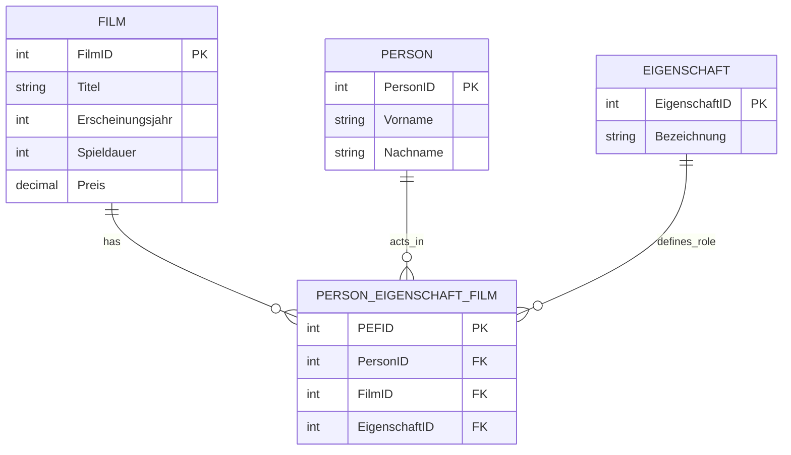
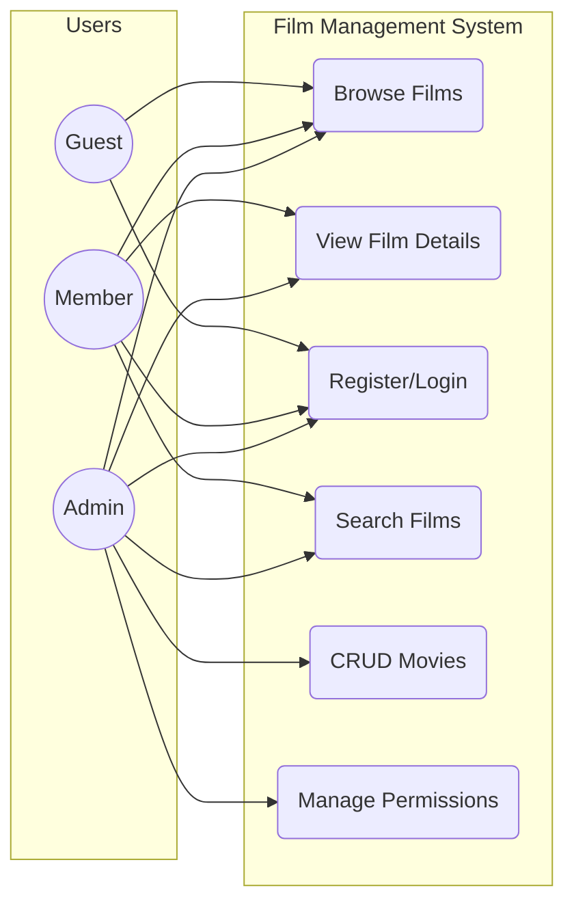
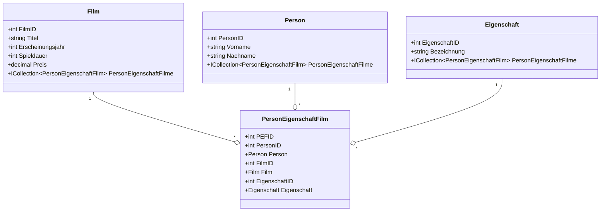
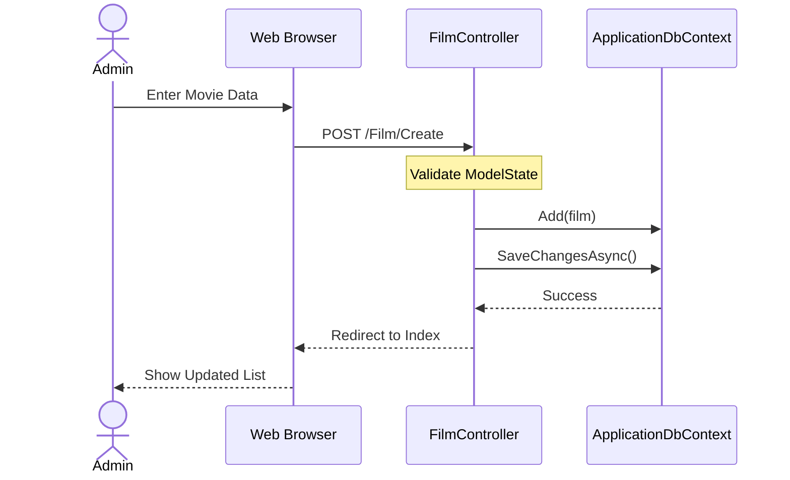
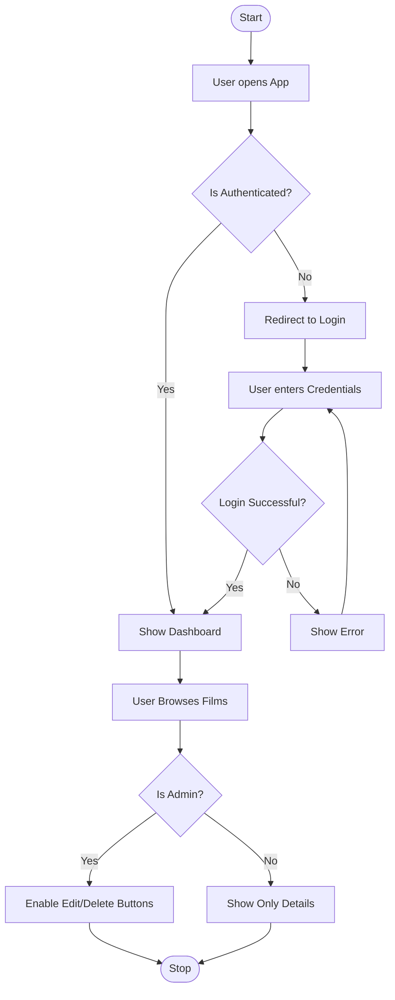
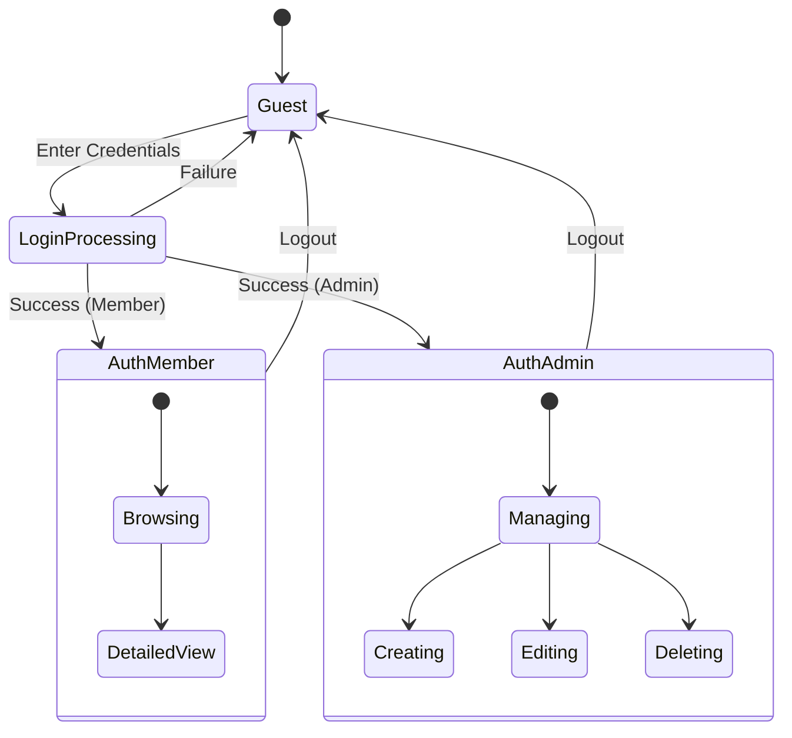

# 📊 FilmDB - Technical Documentation (Diagrams)

This document provides a visual overview of the `10_Filmdatenbank` architecture using Mermaid diagrams.

---

## 1. ERD (Entity Relationship Diagram)

The database schema follows the 3rd Normal Form (3NF) to manage movies, persons, and their roles efficiently.

---

## 2. UML Use Case Diagram

Describes the interactions between different user roles and the system.

---

## 3. UML Class Diagram

Shows the Domain Entities and their relationships within the `_10_Filmdatenbank.Domain` layer.

---

## 4. UML Sequence Diagram (Add Movie Flow)

Illustrates the interaction between the Web UI, Controller, and Database when an Admin adds a new film.

---

## 5. UML Activity Diagram (Application Flow)

Shows the logical flow of a user navigating the application with authentication checks.

---

## 6. UML State Diagram (Auth State)

Visualizes the different states of a user session.

