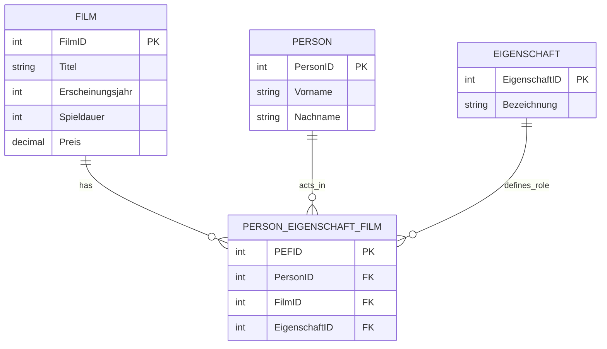
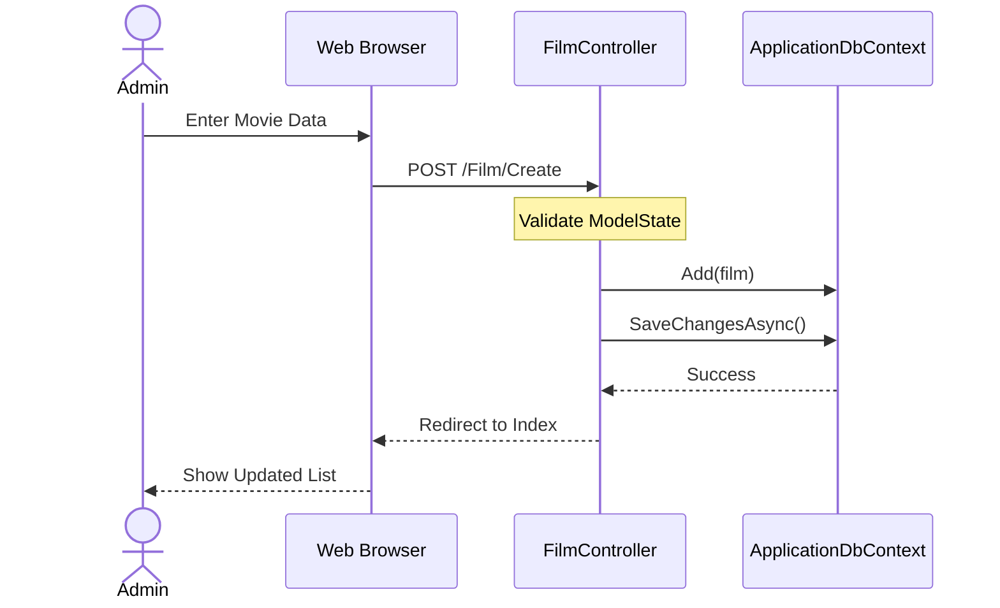
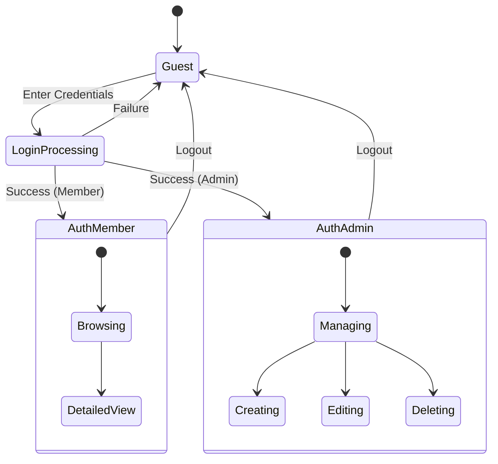

# 📊 FilmDB - Technical Documentation (Diagrams)

This document provides a visual overview of the `10_Filmdatenbank` architecture using Mermaid diagrams.

---

## 1. ERD (Entity Relationship Diagram)
The database schema follows the 3rd Normal Form (3NF) to manage movies, persons, and their roles efficiently.



---

## 2. UML Use Case Diagram
Describes the interactions between different user roles and the system.

```mermaid
usecaseDiagram
    actor "Guest" as G
    actor "Member" as M
    actor "Admin" as A

    M --|> G
    A --|> M

    package "Film Management" {
        usecase "Browse Films" as UC1
        usecase "View Film Details" as UC2
        usecase "Register/Login" as UC3
        usecase "Search Films" as UC4
        usecase "CRUD Movies" as UC5
        usecase "Manage Permissions" as UC6
    }

    G --> UC1
    G --> UC3
    M --> UC2
    M --> UC4
    A --> UC5
    A --> UC6
```

---

## 3. UML Class Diagram
Shows the Domain Entities and their relationships within the `_10_Filmdatenbank.Domain` layer.


---

## 4. UML Sequence Diagram (Add Movie Flow)
Illustrates the interaction between the Web UI, Controller, and Database when an Admin adds a new film.



---

## 5. UML Activity Diagram (Application Flow)
Shows the logical flow of a user navigating the application with authentication checks.

```mermaid
activityDiagram
    start
    :User opens App;
    if (Is Authenticated?) then (yes)
        :Show Dashboard;
        :User Browses Films;
        if (Is Admin?) then (yes)
            :Enable Edit/Delete Buttons;
        else (no)
            :Show Only Details;
        endif
    else (no)
        :Redirect to Login;
        :User enters Credentials;
        if (Login Successful?) then (yes)
            stop
        else (no)
            :Show Error;
            backward:User enters Credentials;
        endif
    endif
    stop
```

---

## 6. UML State Diagram (Auth State)
Visualizes the different states of a user session.


