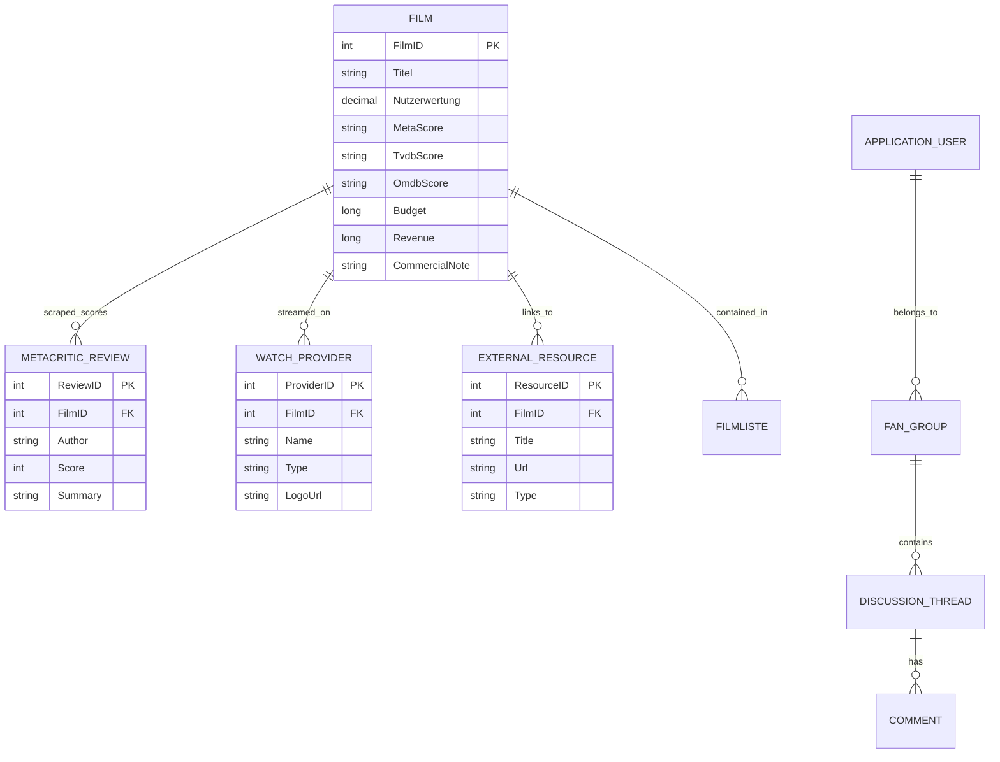
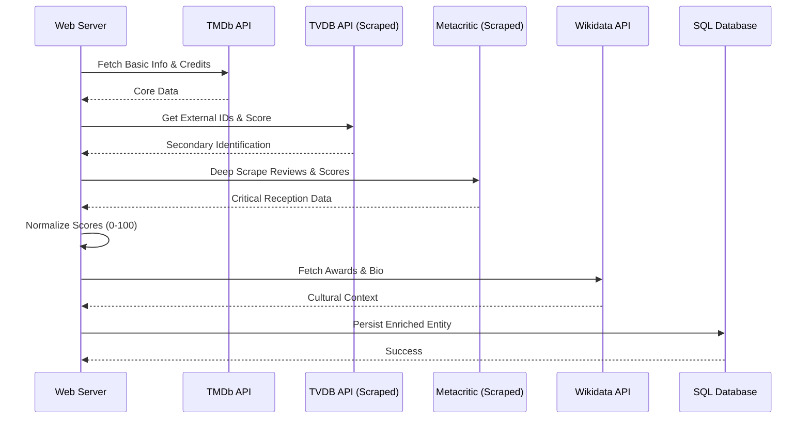

# 🎥 FilmDB - Modernized Architecture (New Diagrams)

This document complements [diagrams.md](diagrams.md) and focuses on the newly implemented systems: **Deep Metadata Scraping**, **Commercial Integration**, and **Community Features**.

---

## 1. Augmented ERD (Metadata & Social)

The updated schema incorporates external scoring, watch providers, and our community/discussion subsystem.



---

## 2. Multi-Source Enrichment Sequence

Illustrates how the `FilmController` orchestrates data from **TMDB**, **TVDB**, **Metacritic**, and **Wikidata** to build a comprehensive profile.



---

## 3. Scraper Logic Flow

Shows the logic used for the custom web scrapers that bypass standard API limitations.


---

## 4. Community Interaction Hierarchy

Visualizes the relationship between users, groups, and content.

```mermaid
graph TD
    User((User)) -- Member --> Group[Fan Group]
    Admin((Admin)) -- Manages --> Group
    Group -- Hosts --> Thread[Discussion Thread]
    Thread -- Contains --> Post[Comment]
    User -- Authors --> Post
    Post -- Replies To --> Post
    System{Notification System} -- Alerts --> User
    Thread -- Triggers --> System

---

## 5. Complete Database ERD (Full Schema)

The following diagram illustrates the entire relational ecosystem of the application, encompassing Core Film Data, Expanded Metadata, Social/Community Features, and the Gamification Engine.

```mermaid
erDiagram
    %% Core Film & Metadata
    FILM ||--o{ PERSON_EIGENSCHAFT_FILM : "crew/cast"
    FILM ||--o{ FILM_AWARD : "honors"
    FILM ||--o{ ALTERNATIVE_TITLE : "aliases"
    FILM ||--o{ FILM_RELEASE : "certifications"
    FILM ||--o{ BOX_OFFICE_ENTRY : "earnings"
    FILM ||--o{ METACRITIC_REVIEW : "critics"
    FILM ||--o{ WATCH_PROVIDER : "stream_links"
    FILM ||--o{ EXTERNAL_RESOURCE : "links"
    FILM }o--o{ GENRE : "classified_as"
    FILM }o--o{ KEYWORD : "tagged_with"
    FILM }o--o{ PRODUCTION_COMPANY : "produced_by"
    FILM }o--o{ COUNTRY : "filmed_in"
    FILM }o--o{ LANGUAGE : "spoken_in"
    FILM |o--o| COLLECTION : "belongs_to"

    %% Person & Awards
    PERSON ||--o{ PERSON_EIGENSCHAFT_FILM : "participates"
    PERSON ||--o{ PERSON_AWARD : "honors"
    EIGENSCHAFT ||--o{ PERSON_EIGENSCHAFT_FILM : "defines_role"

    %% Company
    PRODUCTION_COMPANY ||--o{ PRODUCTION_COMPANY_AWARD : "honors"

    %% Social & Community
    APPLICATION_USER ||--o{ GROUP_MEMBER : "joins"
    APPLICATION_USER ||--o{ DISCUSSION_THREAD : "starts"
    APPLICATION_USER ||--o{ COMMENT : "posts"
    APPLICATION_USER ||--o{ NOTIFICATION : "receives"
    APPLICATION_USER ||--o{ USER_ACHIEVEMENT : "earns"
    APPLICATION_USER ||--o{ FAVORITE_FILM : "likes"
    APPLICATION_USER ||--o{ USER_RATING : "rates"
    APPLICATION_USER ||--o{ MEMBERSHIP_REQUEST : "requests"
    APPLICATION_USER ||--o{ GROUP_BAN : "banned_from"

    FAN_GROUP ||--o{ GROUP_MEMBER : "has"
    FAN_GROUP ||--o{ DISCUSSION_THREAD : "hosts"
    FAN_GROUP ||--o{ MEMBERSHIP_REQUEST : "processes"
    FAN_GROUP ||--o{ GROUP_BAN : "manages"
    FAN_GROUP ||--o{ FAN_GROUP : "subgroup_of"

    DISCUSSION_THREAD ||--o{ COMMENT : "contains"
    ACHIEVEMENT ||--o{ USER_ACHIEVEMENT : "awarded_to"
    
    FAVORITE_FILM }o--|| FILM : "targets"
    USER_RATING }o--|| FILM : "scores"

    %% Table Definitions
    FILM {
        int FilmID PK
        string Titel
        int Erscheinungsjahr
        decimal Nutzerwertung
        long Budget
        long Revenue
    }

    PERSON {
        int PersonID PK
        string Vorname
        string Nachname
        string KnownForDepartment
    }

    APPLICATION_USER {
        string Id PK
        string UserName
        string Email
    }

    FAN_GROUP {
        int FanGroupID PK
        string Name
        bool IsPrivate
    }
```
