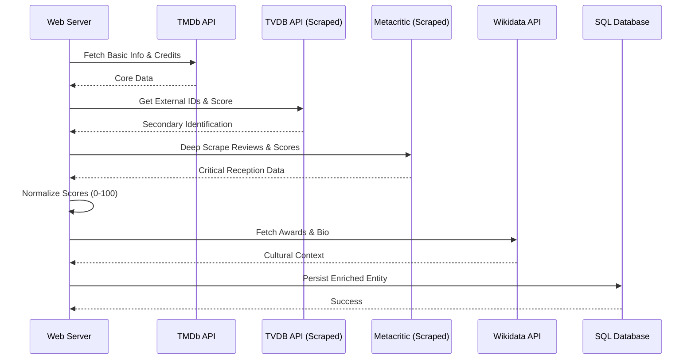
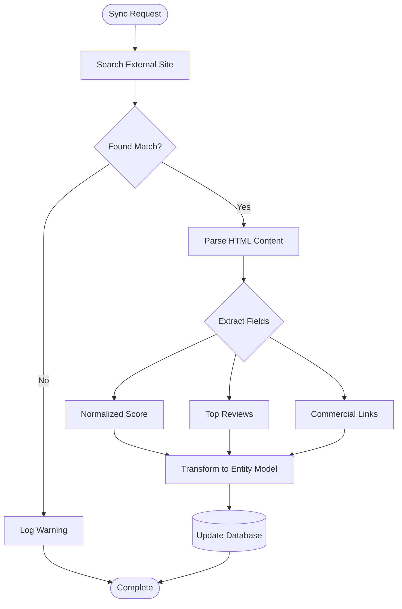
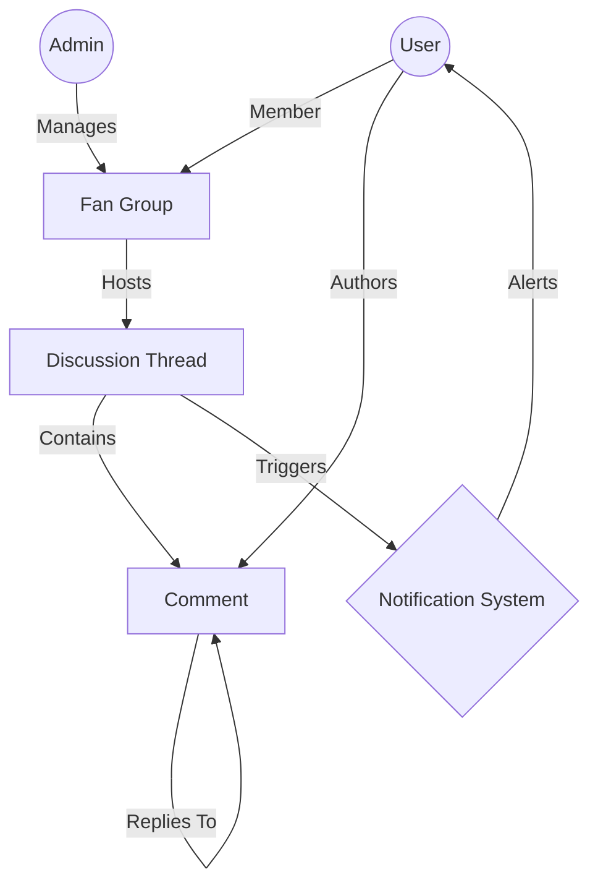

# 🎥 FilmDB - Modernized Architecture (New Diagrams)

This document complements [diagrams.md](diagrams.md) and focuses on the newly implemented systems: **Deep Metadata Scraping**, **Commercial Integration**, and **Community Features**.

---

## 1. Augmented ERD (Metadata & Social)

The updated schema incorporates external scoring, watch providers, and our community/discussion subsystem.

```mermaid
erDiagram
    FILM ||--o{ METACRITIC_REVIEW : "scraped_scores"
    FILM ||--o{ WATCH_PROVIDER : "streamed_on"
    FILM ||--o{ EXTERNAL_RESOURCE : "links_to"
    FILM ||--o{ FILMLISTE : "contained_in"
    
    APPLICATION_USER ||--o{ FAN_GROUP : "belongs_to"
    FAN_GROUP ||--o{ DISCUSSION_THREAD : "contains"
    DISCUSSION_THREAD ||--o{ COMMENT : "has"
    
    FILM {
        int FilmID PK
        string Titel
        decimal Nutzerwertung
        string MetaScore
        string TvdbScore
        string OmdbScore
        long? Budget
        long? Revenue
        string CommercialNote
    }

    WATCH_PROVIDER {
        int ProviderID PK
        int FilmID FK
        string Name
        string Type
        string LogoUrl
    }

    METACRITIC_REVIEW {
        int ReviewID PK
        int FilmID FK
        string Author
        int Score
        string Summary
    }

    EXTERNAL_RESOURCE {
        int ResourceID PK
        int FilmID FK
        string Title
        string Url
        string Type
    }
```

---

## 2. Multi-Source Enrichment Sequence

Illustrates how the `FilmController` orchestrates data from **TMDB**, **TVDB**, **Metacritic**, and **Wikidata** to build a comprehensive profile.



---

## 3. Scraper Logic Flow

Shows the logic used for the custom web scrapers that bypass standard API limitations.



---

## 4. Community Interaction Hierarchy

Visualizes the relationship between users, groups, and content.


